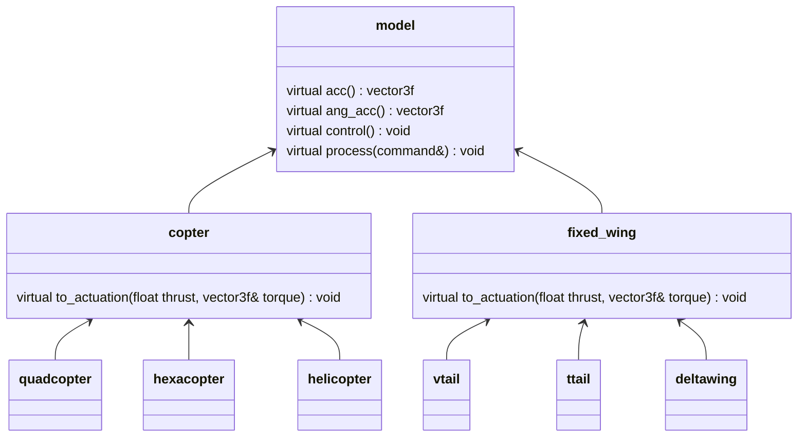
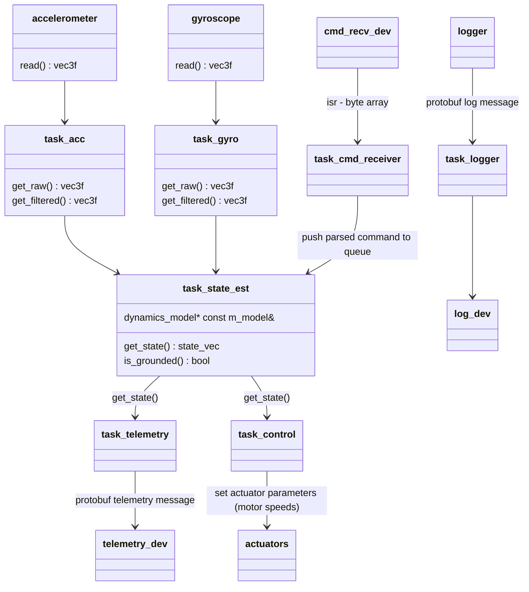
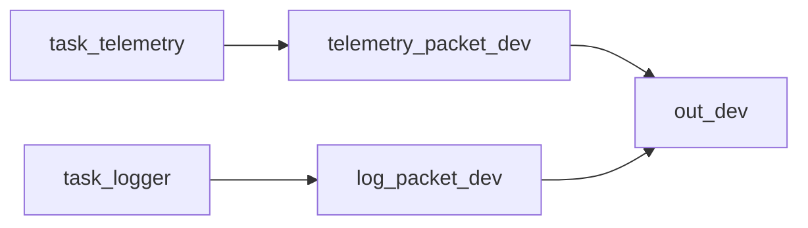

# System overview
Minipilot is based around 2 main subsystems: state estimation and control.

State estimator is the subsystem responsible for combining sensor data and the mathematical model of the vehicle to estimate the current state (position, velocity, rotation, ...).

Control subsystem takes in the current state and the desired state which is sent to the vehicle by the user and calculates what does the vehicle need to do to achieve the given state. For example if we are driving a car and the user sets the desired speed at 2 m/s, then the control subsytem produces the needed actuation (gas or brake) to achieve that speed.

## Vehicle model
When it comes to describing a vehicle's properties, the dynamics `model` has 2 main roles: providing the mathematical model (forces and torques which act on the vehicle) for the state estimator, and converting the desired control input from the user into the actuator paramters (motor speeds, control surface angles, ...) to achieve the desired state.

Different models allow different types of requests we can issue to the vehicle, which depend on the type of the vehicle and the number of degrees of freedom the vehicle has. `copter` model for example allows us to control the desired velocity in any direction, or set the desired thrust and torque. `fixed_wing` model on the other hand doesn't allow us to set desired velocity because it can't change it's horizontal or vertical velocity independently, but allows for setting the climb rate, ground speed, heading... Once the copter model calculates the needed thrust and torque to achieve the user's command, it would call the derived model's (quadcopter, hexacopter, helicopter...) method to convert these values into the actual motors speeds. Similarly the fixed wing model would than ask the derived model to convert the thrust and torque values into control surface angles and motors speeds which depend on the aircraft geometry.

### Dynamics model hierarchy example

Each of the implementations of the model (quadcopter, vtail, ...) has a reference to all the actuators supported/needed by the model (motors, servos, ...).

## System architecture
Each sensor has a dedicated task which is responsible for periodically reading data from the device and applying necessary pre-processing: for gyro apply band-pass filter, for magnetometer apply hard-iron and soft-iron inverse transformations, for accelerometer can apply notch filters...

All of this information is periodically gathered by the main (state estimator) task which then executes an iteration of the EKF. Once the new state is calculated, this task then goes through all the parsed commands received from the user which are waiting in the queue and calls the model's process method on each of them. This ensures that the model has the latest user input before running the control part of the algorithm. Final part of this task's execution loop is running the model's control algorithm.

Telemetry task is in charge of periodically fetching the state data from the main task, packing it into a protobuf message, and sending it to the user via a provided telemetry device.

All logging calls in this system are packed into protobuf messages which are then enqueued in the logging task. This task then empties this queue as the log device becomes available.

If using the same output device for telemetry and logs, the following data flow is used:

where telemetry_packet_dev and log_packet_dev are instances of a message_pack : public char_dev class which takes a byte array and creates a protobuf message containing that array and an enum which carries information about the message type (source).