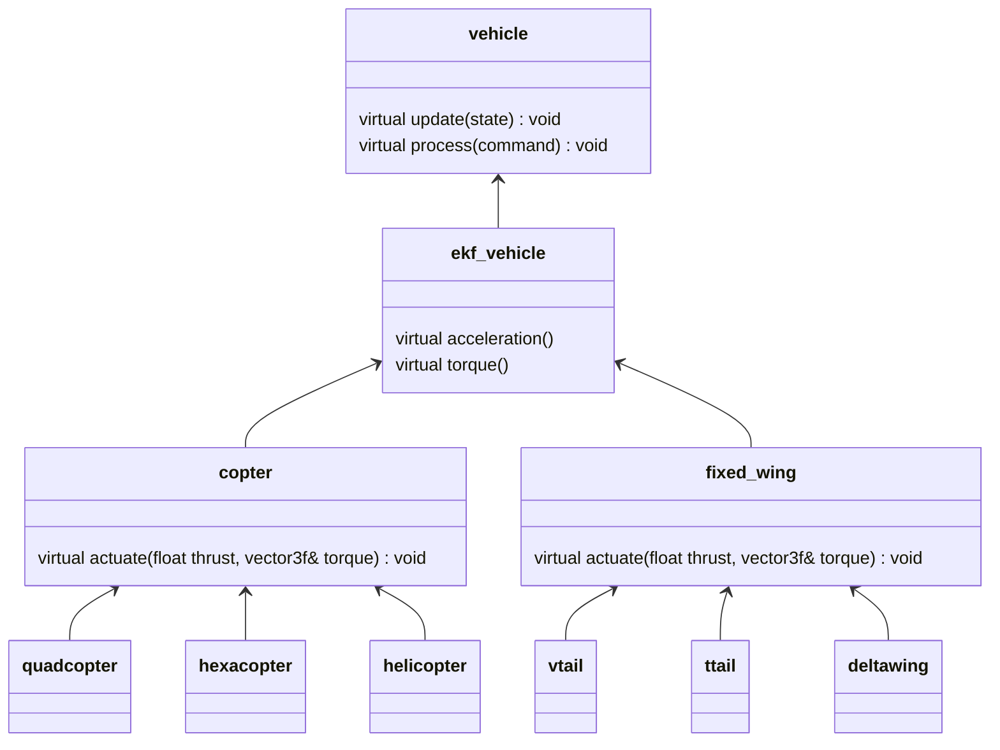
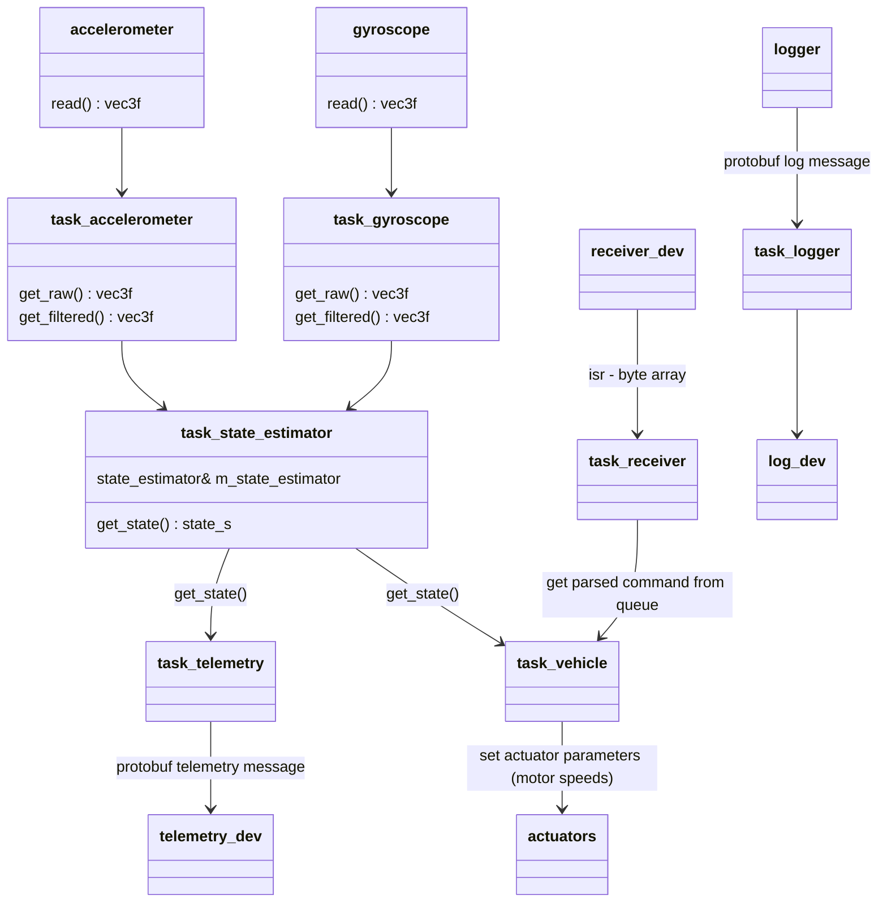
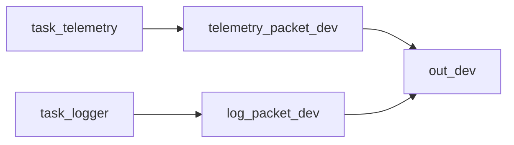

# System overview
Minipilot is based around 2 main subsystems: state estimation and vehicle control.

State estimator is the subsystem responsible for combining sensor data and the mathematical model of the vehicle to estimate the current state (position, velocity, rotation, ...). This can be done using different algorithms such as EKF, Complementary filter, etc.

Vehicle control subsystem takes in the current state and the commands which are sent to the vehicle by the user and calculates what does the vehicle need to do to achieve a desired state. For example if we are driving a car and the user sets the desired speed at 2 m/s, then the control subsytem produces the needed actuation (throttle and brake amount) to achieve that speed.

## Vehicle model
When it comes to describing a vehicle's capabilities, the [vehicle](/src/vehicles/vehicle.hpp) interface has 2 main methods: `update` which runs an iteration of the control algorithm based on the current state provided by the state estimator, and `handle_command`, which provides a way for the user to communicate with the vehicle. Commands can be different for each derived class and can be discarded by the implementation of the method as not correct for the given vehicle type.

Extension of this interface is the [ekf_vehicle](/src/vehicles/ekf_vehicle.hpp) which provides the dynamical model of the vehicle, such as the expected acceleration and torque based on current actuator settings. This information can be used by some state estimator such as the EKF (hence the name) to correct the potential sensor noise errors and create a smoother estimation.

### Vehicle hierarchy

Each of the implementations of the model (quadcopter, vtail, ...) has a reference to all the actuators supported/needed by the model (motors, servos, ...).

## System architecture
Each sensor has a dedicated task which is responsible for periodically reading data from the device and applying necessary processing: for gyro apply band-pass filter, for magnetometer apply hard-iron and soft-iron inverse transformations, for accelerometer can apply notch filters...

All of this information is periodically gathered by the state estimator task which then executes an iteration of the user-chosen algorithm. Once the new state is calculated, it is available to other tasks such as telemetry or vehicle control.

Vehicle task goes through all the parsed commands received from the user which are waiting in a queue and calls the model's handle method on each of them. This ensures that the model has the latest user input before running the vehicle's update method (control algorithm).

Telemetry task is in charge of periodically fetching the state data from the main task, packing it into a protobuf message, and sending it to the user via a provided telemetry device.

All logging calls (log_debug, log_warning, etc.) in this system are enqueued in the logging task. This task then empties this queue as the log device becomes available and sends the data in raw or protobuf formats depending on the configuration.

If using the same output device for telemetry and logs, the following data flow is used:

where `telemetry_packet_dev` and `log_packet_dev` are instances of a `message_pack` : public `char_dev` class which takes a byte array and creates a protobuf message containing that array and an enum which carries information about the message type (source).